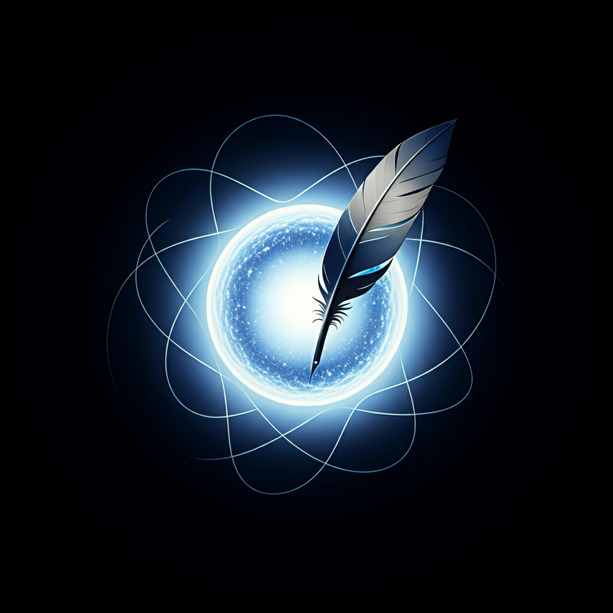
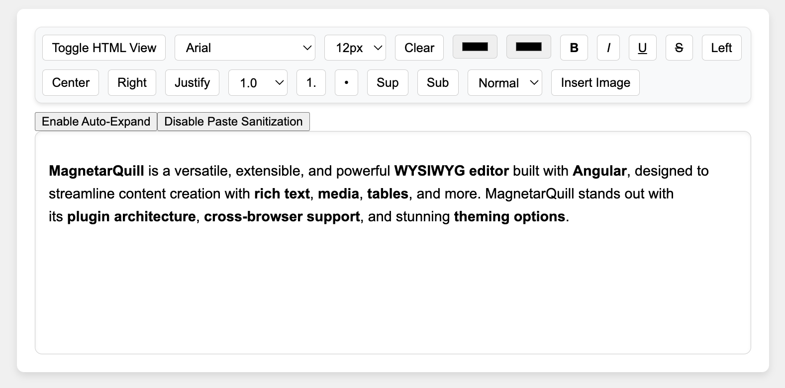

# **MagnetarQuill** 🖋✨  
> **The Next-Gen Universe-Inspired WYSIWYG Editor - Built with Angular** 🚀💫  



**MagnetarQuill** is a versatile, extensible, and powerful **WYSIWYG editor** built with **Angular**, designed to streamline content creation with **rich text**, **media**, **tables**, and more. MagnetarQuill stands out with its **plugin architecture**, **cross-browser support**, and stunning **theming options**.

Inspired by the most extreme phenomena in the universe, the **Magnetar**, and combined with the elegance of a quill, this editor takes your text editing experience beyond the ordinary.

---
## **Current view** 🌟


---

## **Table of Contents** 📚
- [Features](#features-)
- [Installation](#installation-)
- [Quick Start](#quick-start-)
- [Usage](#usage-)
- [Plugin Architecture](#plugin-architecture-)
- [Theming & Customization](#theming--customization-)
- [Available Commands](#available-commands-)
- [Roadmap](#roadmap-)
- [Contributing](#contributing-)
- [License](#license-)

---

## **Features** 🌟

MagnetarQuill is packed with features to meet all your content creation needs:

- 🖋 **Text Formatting**: Support for **bold**, **italic**, **underline**, **strikethrough**, and more.
- 🎨 **Custom Fonts and Colors**: Easily change fonts, text colors, and background colors.
- 📝 **Headers & Lists**: Support for custom headers (H1-H6) and ordered/unordered lists.
- 📷 **Insert Media**: Insert and edit images, videos, links, and more.
- 📊 **Tables & Block Elements**: Create and manage tables, blockquotes, and code blocks.
- ✂ **Rich Clipboard Support**: Cut, copy, and paste rich text, media, and external content.
- 🔄 **Undo/Redo History**: Track changes with multi-step undo/redo support.
- 🌐 **Cross-Browser & Responsive**: Full support across Chrome, Firefox, Safari, Edge, and mobile browsers.
- 🎛 **Plugin Architecture**: Extend MagnetarQuill with custom plugins for endless possibilities.
- 🎨 **Theme Support**: Light, dark, and fully customizable themes with localization options.
- 💾 **Export & Import**: Save your work as **HTML**, **Markdown**, **RTF**, or **PDF**.

---

## **Installation** 🛠

### Prerequisites
- **Node.js** (v16.x or higher) and **Angular CLI** (v17.3.0 or higher) — *only needed if you plan to build or customize MagnetarQuill within an Angular environment.*

> **Note**: For general use in frameworks like React or Vue, or in vanilla JavaScript, you can use MagnetarQuill as a standalone web component without Angular-specific prerequisites.

To install the MagnetarQuill library from npm, run the following command:

```bash
npm i --save magnetar-quill
```

### Step 1: Clone the Repository

```bash
git clone https://github.com/yourusername/magnetarquill.git
cd magnetarquill
```

### Step 2: Install Dependencies

```bash
npm install
```

### Step 3: Run the Development Server

```bash
ng serve
```

Open your browser at [http://localhost:4200](http://localhost:4200) to see **MagnetarQuill** in action!

---

## **Quick Start** 🚀

To get up and running with **MagnetarQuill**:

1. Import the core `MagnetarQuillModule` into your **Angular** application.
   
    ```typescript
    import { MagnetarQuillModule } from 'magnetarquill';

    @NgModule({
      imports: [MagnetarQuillModule],
      declarations: [AppComponent],
      bootstrap: [AppComponent],
    })
    export class AppModule {}
    ```

2. Add the **MagnetarQuill** component to your template:
   
    ```html
    <magnetar-quill [(ngModel)]="documentContent"></magnetar-quill>
    ```

3. Start editing with a galaxy of rich features at your fingertips!

---

## **Usage** ✍️

### **Text Formatting**

Format text using **bold**, **italic**, **underline**, and **strikethrough** options:
```html
<magnetar-quill></magnetar-quill>
```

You can also style text with **headers**, **lists**, and **blockquotes**:
```html
<magnetar-quill [formatOptions]="['headers', 'lists', 'blockquotes']"></magnetar-quill>
```

### **Image and Media Insertion**

Upload and edit images with resizing, alignment, and captions:
```html
<magnetar-quill [mediaOptions]="['images', 'videos']"></magnetar-quill>
```

### **Clipboard Support**

MagnetarQuill handles pasted content seamlessly:
```html
<magnetar-quill enableClipboardSupport="true"></magnetar-quill>
```

### **File Export & Import**

Save your work in different formats like **HTML**, **RTF**, or **Markdown**:
```typescript
const htmlContent = this.editor.exportAsHTML();
const markdownContent = this.editor.exportAsMarkdown();
```

---

## **Plugin Architecture** 🔌

MagnetarQuill is built with extensibility in mind. You can easily add custom plugins to extend functionality.

### **Creating a Plugin**

1. Create a new plugin that adds a custom toolbar button:
    ```typescript
    const myPlugin = {
      name: 'customButton',
      action: () => {
        console.log('Custom button clicked!');
      },
    };
    ```

2. Register the plugin with **MagnetarQuill**:
    ```typescript
    this.editor.registerPlugin(myPlugin);
    ```

### **Available Plugin Hooks**

- **onTextChange**: Listen for text changes.
- **onObjectInsertion**: Trigger actions on media insert.
- **onFormattingChange**: Track formatting updates.

Extend the editor with limitless possibilities! 🎉

---

## **Theming & Customization** 🎨

MagnetarQuill provides full support for **light** and **dark** themes, along with the ability to create **custom themes**.

### **Light/Dark Mode Switch**

Toggle between light and dark modes:
```html
<magnetar-quill [theme]="dark ? 'dark' : 'light'"></magnetar-quill>
```

### **Custom Themes**

Create your own theme by defining custom styles:
```typescript
const customTheme = {
  textColor: '#4a4a4a',
  backgroundColor: '#f0f0f0',
  toolbarColor: '#333',
};

this.editor.applyTheme(customTheme);
```

---

## **Available Commands** 📜

- `ng serve`: Start the development server.
- `ng build`: Build the project for production.
- `ng test`: Run unit tests.
- `ng lint`: Lint the codebase for errors.

---

## **Roadmap** 🛣

🔭 **Upcoming Features**:
- Integration with **Google Docs** and **Microsoft Word**.
- More advanced **collaborative editing** tools.
- Enhanced **accessibility features**.
- **Mobile optimization** for touch devices.
- **Real-time spell checking** via external plugins.

---

## **Contributing** 🤝

We welcome contributions! Here's how you can help:
1. **Fork the repository**.
2. **Create a new branch** for your feature or bug fix:
   ```bash
   git checkout -b feature/my-awesome-feature
   ```
3. **Commit your changes** and open a pull request:
   ```bash
   git push origin feature/my-awesome-feature
   ```
4. We’ll review your PR and merge it!

Please read our [Contributing Guidelines](CONTRIBUTING.md) for more details.

---

## **License** 📄

MagnetarQuill is licensed under the **MIT License**. See the [LICENSE](LICENSE) file for more information.

---

## **Stay Connected** 💬

Follow us for updates, news, and more:
- **Twitter**: [@MagnetarQuill](https://twitter.com/magnetarquill)
- **GitHub Discussions**: [MagnetarQuill Discussions](https://github.com/yourusername/magnetarquill/discussions)

---
### Project Progress

### Project Progress

Here’s the updated table with the latest progress:

| Step  | Feature Description                                   | Status       | Version Name         |
|-------|-------------------------------------------------------|--------------|----------------------|
| 1     | Project Setup and Angular Initialization              | ✅ Completed  | Version 0.1 - Setup  |
| 2     | Implement Bold, Italic, Underline, Strikethrough       | ✅ Completed  | Version 0.2 - Basic Text Formatting |
| 3     | Font Family and Font Size Dropdowns                   | ✅ Completed  | Version 0.3 - Font Options |
| 4     | Text & Background Color Pickers                       | ✅ Completed  | Version 0.4 - Color Selection |
| 5     | Text Alignment & Line Spacing                         | ✅ Completed  | Version 0.5 - Text Alignment & Spacing |
| 6     | Ordered and Unordered Lists                           | ✅ Completed | Version 0.6 - Lists and Alignment |
| 7     | Custom Headers (H1-H6)                                | ✅ Completed | Version 0.7 - Headers and Block Elements |
| 8     | Image Insertion and Editing                           | 🔄 In Progress| Version 0.8 - Image Support |
| 9     | Copy-Paste Image Support                              | 🔄 In Progress| Version 0.9 - Image Clipboard |
| 10    | Table Insertion and Editing                           | 🔄 In Progress| Version 0.10 - Table Management |
| 11    | Object Context Menu                                   | 🔄 In Progress| Version 0.11 - Object Management |
| 12    | Drag-and-Drop Object Repositioning                    | 🔄 In Progress| Version 0.12 - Object Repositioning |
| 13    | Rich Text Copy-Paste Support                          | 🔴 Not Started| Version 0.13 - Rich Text Clipboard |
| 14    | Text Sanitization on Paste                            | 🔴 Not Started| Version 0.14 - Paste Sanitization |
| 15    | Undo/Redo Functionality                               | 🔴 Not Started| Version 0.15 - Undo/Redo |
| 16    | Multi-Step History Support                            | 🔴 Not Started| Version 0.16 - History Features |
| 17    | HTML and Markdown Export                              | 🔴 Not Started| Version 0.17 - File Export |
| 18    | File Loading (HTML & RTF)                             | 🔴 Not Started| Version 0.18 - File Import |
| 19    | Full-Screen Mode                                      | 🔴 Not Started| Version 0.19 - Full-Screen |
| 20    | Light and Dark Theme Support                          | 🔴 Not Started| Version 0.20 - Theme Customization |
| 21    | Plugin System for Custom Toolbar Tools                | 🔴 Not Started| Version 0.21 - Plugin Support |

